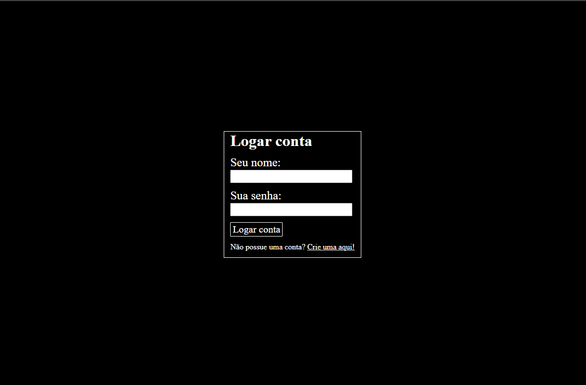
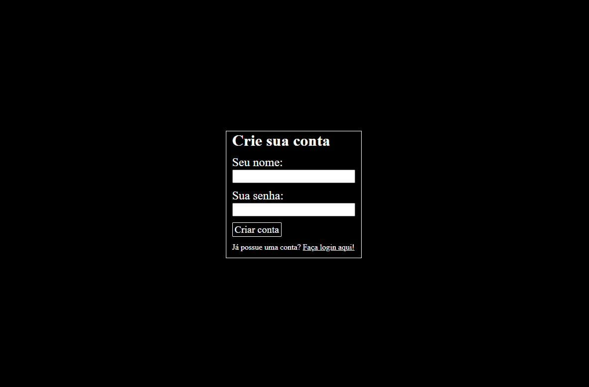
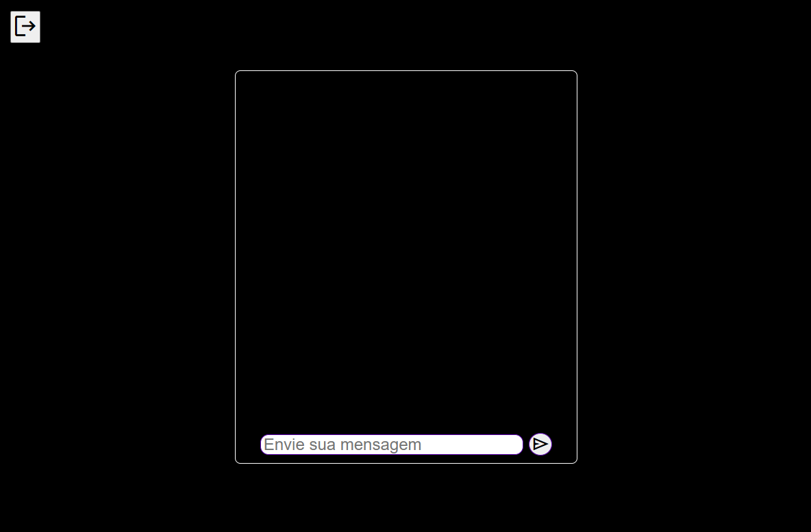
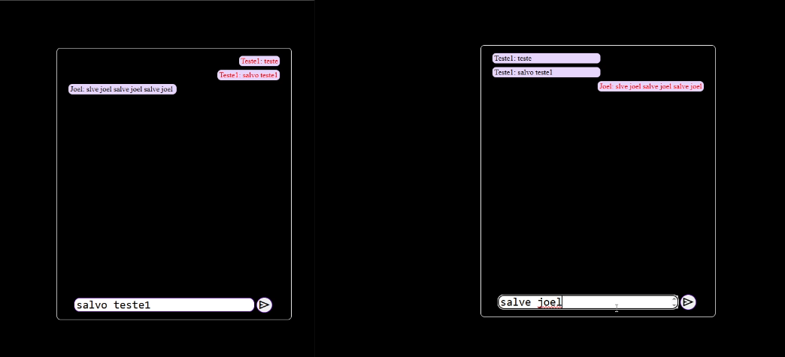

# 📖 O que é
### 

# 🛠️ Ferramentas Utilizadas

  Node.js  
  WebSockets  
  MongoDB  
  Mongoose  
  JavaScript  
  HTML  
  CSS  

# 🎯 Funcionalidades
☑ API RESTful  
☑ Comunicação entre usuários através de WebScokets   
☑ Cadastro de usuários  
☑ Validação de login  
☑ JWT para Autentificação  
☑ Criptografia de senhas com Hash (bcrypt)  

# 🎞 Visual do Projeto

## LandPage

## Sistema de Login

  
  

## Enviar mensagens

  
  

# ⚙ Como utilizar

O projeto possui HTML estático, portanto é possível que você precise mudar as URLs no front-end. Já o servidor é necessário rodar 2 terminais, um para iniciar o banco de dados, e o outro para iniciar o servidor
  

## 🎲 Banco de Dados
### Garanta que antes de iniciar o servidor, você esteja com seu banco de Dados Mongo iniciado
Inicialização usando o comando mongod no terminal/prompt de comando: 

    Abra o terminal/prompt de comando e digite:
    mongod
Este comando iniciará o servidor MongoDB e ele começará a ouvir conexões no padrão porta 27017. 

**O Mongo ja cuida de criar um banco de dados assim que o primeiro dado for inserido**

## 📦 Back-end

### Navegue até a pasta do Back-End
    cd servidor
### Instale as dependências
    npm install
### Rode o projeto
    npm start

#### O servidor vai rodar em http://localhost:8081 (Você pode mudar a porta no código do servidor). O WebSocket vai rodar em ws://localhost:8080 (Você também pode mudar a porta no código do servidor)

## 📦 Front-End
    Navegue até a pasta do Front-End chamada 'interactivity'
### Arquivos de cadastro
#### Existem dois arquivos
    signIn.js
    signUp.js
#### Mude a constante 'serverUrl'
    Exemplo:
    const serverUrl = 'http://localhost:8081'
Nessa constante você tem que colocar a URL onde ser servidor está rodando

### Chat Global se conectando
No arquivo chatGlobal.js, a primeira linha será da conexão com seu servidor WebSockets.

    Exemplo:
    const ws = new WebSocket('ws://localhost:8080')
    
Garanta que a URL que está dentro dos parentêses é a mesma em que ser servidor webSockets está rodando

### Crie um arquivo dotenv para amazenar as configurações do JWT
    Crie um arquivo '.env' na pasta backEnd
    Configure as variaveis 'chaveSecreta' e 'tokenDuration'
    Exemplo: 
    chaveSecreta='minha_Aplicação'
    tokenDuration=7200

Essas variaveis servem para a configuração do JWT (Json Web Token)

## 📡 Endpoints que serão criados

### 📤 **POST**

| Rota                            | Descrição                                                                |
|:--------------------------------|:-------------------------------------------------------------------------|
| `/userPost`                   | Rota usada para cadastrar usuários                                                 |
| `/userGet`                 | Rota usada para encontrar um usuário e retorn um token JWT                                          |
