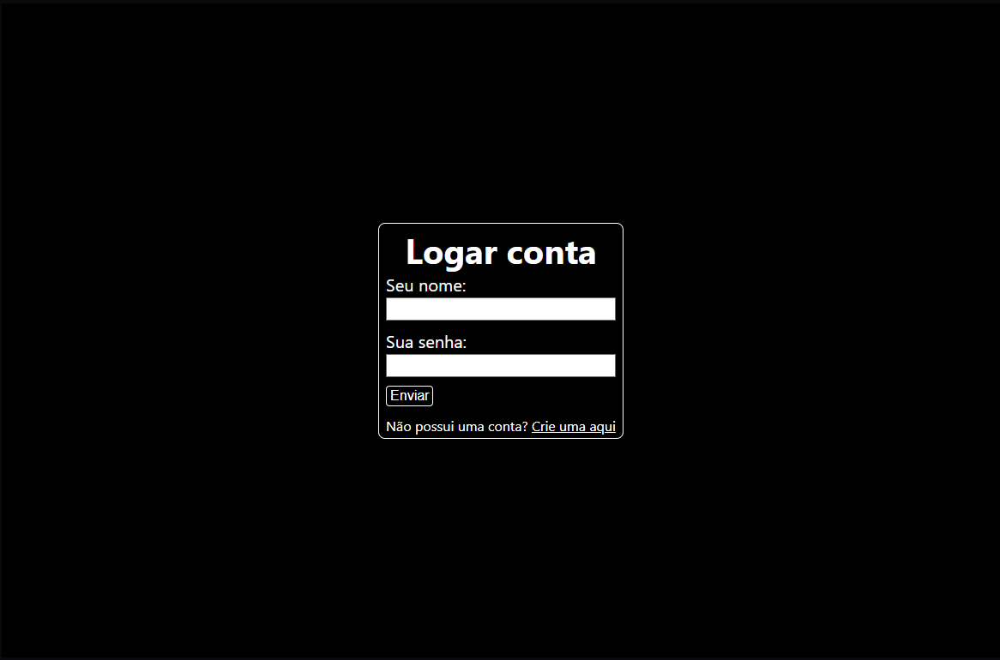
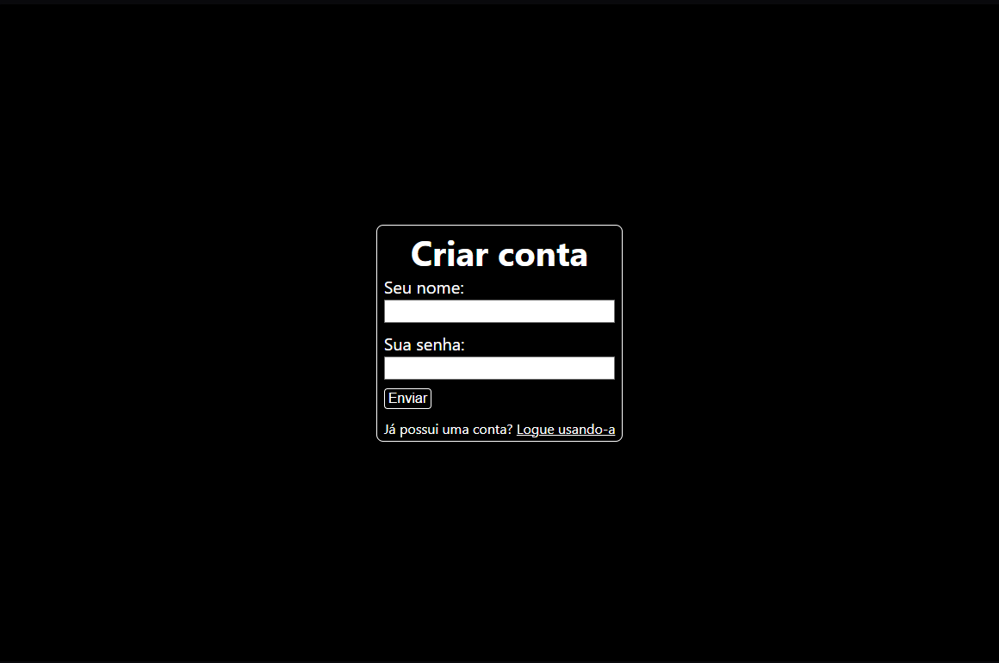
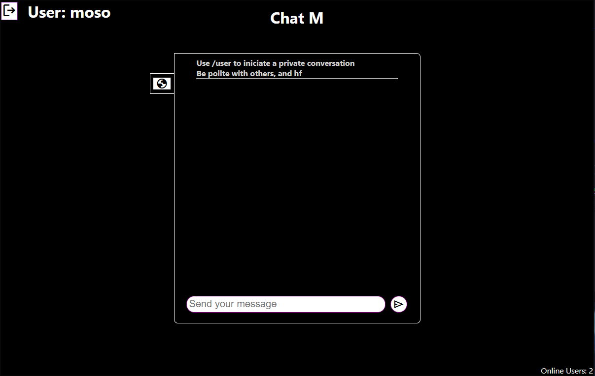
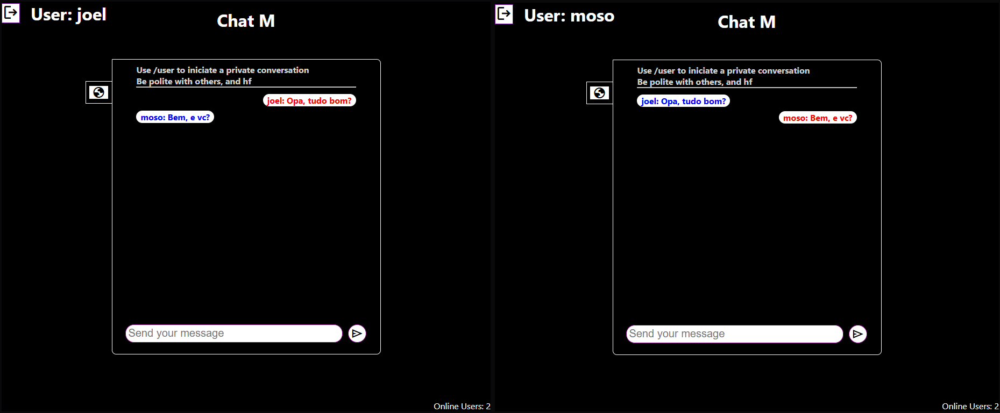
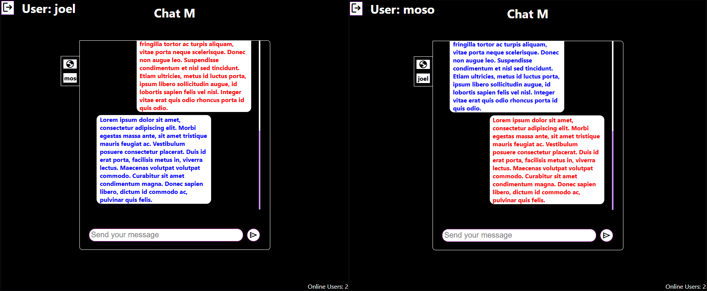

# 📖 O que é
### Terceiro projeto de uma serie de 3, criado para aprendizado, que utiliza com principal tecnologia o WebSockets. A terceira parte é o projeto que junta os 2 conceitos dos projetos anteriores, possibilita o uso de um chat global e a função de poder conversar em chats privados. Websockets é uma ferramenta que possibilita a criação de uma comunicação simultânea entre cliente-servidor, utilizada na criação de jogos, chats em tempo real e outros sistemas de comunicação dinâmica.

# Base do projeto
O projeto trabalha com três conjuntos de dados dinâmicos, são eles os **'spans'**, as **'divs' de conversa'**, e os **'dados para as global messages'**.   Os **'spans'** são utilizados para controlar com quem o usuário está conversando.  As **'divs de conversa'** são utilizadas para criar uma nova conversa de um usuário para o outro, e armazenar os dados.  E por fim, os **dados para as global messages**, que é utilizado para armazenar as mensagens globais.   Para poder controlar esses 3 campos, armazenamos os dados recebidos pelo servidor em três hooks de estado, 'dataForTheSpans', 'dataForTheDivs' e 'dataForGlobalMessages'. Assim, sempre que um nova conversa for criada, guardamos essa criação no 'dataForTheSpans' e no 'dataForTheDivs'. Quando alguem enviar uma mensagem global ela é armazenada no 'dataForGlobalMessages'. E quando uma mensagem privada for enviada/recebida, ela fica armazenada dentro de um array no hook de estado 'dataForTheDivs'

    {
      userName: userHost, 
      messages: [{
        sender: 'host',
        message: data.msg
      }]
    }

**'userName'** é utilizado para controlar com quem estamos conversando.  **'messages'** guarda um array de objetos, cada objeto é uma mensagem com os campos **'sender'** e **'message'**. Sender poderá ter um de dois valores, **'host'** ou **'origin'**, origin para quando o nosso usuário atual for quem enviou a mensagem, e host para quando a mensagem tiver vindo de um outro usuário

# 🛠️ Ferramentas Utilizadas

  Node.js  
  React.js  
  WebSockets  
  MongoDB  
  Mongoose  
  JavaScript  
  HTML  
  CSS  

# 🎯 Funcionalidades
☑ API RESTful  
☑ Comunicação entre usuários através de WebScokets   
☑ Cadastro de usuários  
☑ Validação de login  
☑ JWT para Autentificação  

# 🎞 Visual do Projeto

## 🔐 Sistema de Login

  
  

## 💻 Aparência

  

## 📲 Enviar mensagens

  
  

  
  

  

# ⚙ Como utilizar

O Projeto é dividido em 2 pastas principais, uma para o Front-end com React.js e outra para o Back-end com Node.js, serão necessário rodar 3 terminais, pois você também precisa inicializar seu banco de dados
  

## 🎲 Banco de Dados
### Garanta que antes de iniciar o servidor, você esteja com seu banco de Dados Mongo iniciado
Inicialização usando o comando mongod no terminal/prompt de comando: 

    Abra o terminal/prompt de comando e digite:
    mongod
Este comando iniciará o servidor MongoDB e ele começará a ouvir conexões no padrão porta 27017. 

**O Mongo ja cuida de criar um banco de dados assim que o primeiro dado for inserido**

## 📦 Front-End

### Navegue até a pasta do Front-End
    cd frontend
### Instale as dependências
    npm install
### Inicialize o projeto
    npm start
### Crie um arquivo dotenv para armazenar a URL (Opcional)
    Crie um arquivo '.env'
    Configure a URL gerada pelo servidor. Exemplo: 
    REACT_APP_URLCONNECTIONWS='ws://localhost:8081'
    REACT_APP_URLCONNECTIONHTTP='http://localhost:8081'

Isso fará com que toda a aplicação Front-end se conecte com o servidor

Essa parte é opcional pois o código ja possui uma verificação sobre se existem variáveis .env, se n existe ele usa os valores padrões, que são os mesmos do código de exmplo acima

## 📦 Back-end

### Navegue até a pasta do Back-End
    cd servidor
### Instale as dependências
    npm install
### Rode o projeto
    npm start

#### O servidor vai rodar em http://localhost:8081 (Você pode mudar a porta no código do servidor). O WebSocket está integrado no servidor, portanto a porta será a mesma porta, a diferença é que, para acessar o ws, você ao invés de usar 'http://', usará 'ws://'

### Crie um arquivo dotenv para armazenar as configurações do JWT
    Crie um arquivo '.env' na pasta backEnd
    Configure as variáveis 'chaveSecreta', 'tokenDuration' e 'dbConnectionURL'
    Exemplo: 
    chaveSecreta='minha_Aplicação'
    tokenDuration=7200
    dbConnectionURL='mongodb://127.0.0.1:27017/chatM'

chaveSecreta e tokenDuration servem de controle para a configuração do JWT. Já o 'dbConnectionURL' é essencial para criar a conexão entre servidor e banco de dados

## 📡 Endpoints que serão criados

### 📤 **POST**

| Rota                            | Descrição                                                                |
|:--------------------------------|:-------------------------------------------------------------------------|
| `/createUser`                   | Rota usada para cadastrar usuários                                                 |
| `/returnUser`                 | Rota usada para encontrar um usuário e retornar um token JWT                                          |
